# 🚀 Aravind Remanan Kumary Asha • Data Scientist & IIoT Specialist

<div align="center">
  
```ascii
    ╔══════════════════════════════════════════════════════════════╗
    ║  "Transforming industrial data into intelligent solutions"  ║
    ╚══════════════════════════════════════════════════════════════╝
```

**MSc Web & Data Science** | **Certified Scrum Master** | **Stuttgart, DE**

</div>

## 👨‍💻 About Me

Hey there! I'm Aravind, a **Data Scientist** and **Industrial IoT Specialist** currently working at **Deutsches Zentrum für Luft- und Raumfahrt (DLR)** in Stuttgart. With 5+ years of experience spanning from IoT analytics at Infosys to cutting-edge research in additive manufacturing, I specialize in building end-to-end data solutions that bridge the gap between complex industrial systems and actionable insights.

```python
class Aravind:
    def __init__(self):
        self.role = "Data Scientist & IIoT Specialist"
        self.current_workplace = "DLR (German Aerospace Center)"
        self.education = ["MSc Web & Data Science", "BCA Computer Applications"]
        self.certifications = ["Certified Scrum Master", "ERASMUS Plus Scholar"]
        self.specialties = [
            "Industrial IoT & Automation", 
            "Time Series Analytics", 
            "Digital Twin Integration",
            "Real-time Data Streaming"
        ]
        self.fun_fact = "I turn robot data into rocket science! 🤖🚀"
    
    def get_current_projects(self):
        return [
            "🔋 Alkaline Water Electrolysis optimization at DLR",
            "🤖 Robotic Screw Extrusion Additive Manufacturing",
            "📊 Real-time industrial data streaming pipelines"
        ]
```

## 🛠️ Tech Arsenal

<details>
<summary>🏭 <strong>Industrial IoT & Automation</strong></summary>
<br>

**IIoT Protocols & Integration**
- **Communication**: OPC UA, MQTT, Industrial Ethernet
- **Robotics**: KUKA robots, RoboDK, KUKA RSI
- **Standards**: Industry 4.0, Digital Twin, FAIR data principles

**Real-time Systems**
- ⚡ Real-time data streaming from industrial robots
- 🔄 ETL pipeline orchestration for manufacturing data
- 📡 Time series data processing and anomaly detection
- 🏭 Human-Machine Interface (HMI) development

</details>

<details>
<summary>🧠 <strong>Data Science & Machine Learning</strong></summary>
<br>

**Core ML & Analytics**
- **Languages**: Python, SQL, Java, C++ (Embedded)
- **ML Libraries**: Scikit-Learn, TensorFlow, PyTorch
- **Data Processing**: Pandas, NumPy, SciPy
- **Statistical Analysis**: Advanced time series modeling, KPI frameworks

**Specialized Applications**
- 📈 Predictive maintenance for manufacturing systems
- 🎯 Anomaly detection (73% improvement achieved)
- 🔋 Battery testing optimization (20% deployment improvement)
- 🚗 Adaptive Cruise Control efficiency enhancement (20% improvement)

</details>

<details>
<summary>☁️ <strong>Data Engineering & DevOps</strong></summary>
<br>

**Cloud & Infrastructure**
- **Platforms**: Databricks, Docker, Kubernetes
- **Databases**: PostgreSQL, MySQL, MongoDB, InfluxDB, Neo4j, Shepard DB
- **APIs**: FastAPI development, RESTful services
- **Validation**: Great Expectations, Pydantic

**Development & Deployment**
- 🔄 CI/CD pipelines (GitLab, Jenkins, Bitbucket)
- 📊 Automated reporting (90% time reduction achieved)
- 🐳 Containerized deployments with Docker
- 📈 Data quality frameworks for time series data

</details>

<details>
<summary>📊 <strong>Visualization & Business Intelligence</strong></summary>
<br>

**Data Visualization**
- **Tools**: Tableau, Streamlit, Taipy, Matplotlib
- **Dashboards**: Real-time operational dashboards
- **Reporting**: Automated strategic reports and KPI tracking

**Project Management**
- 🏃‍♂️ Agile methodologies (Certified Scrum Master)
- 🛠️ JIRA, Confluence, Miro, Azure DevOps
- 👥 Cross-functional team leadership

</details>

## 🏆 Professional Experience

### 🚀 **Current: DLR** *(Sept 2023 - Present)*
*German Aerospace Center - Stuttgart, Germany*

**Key Achievements:**
- 📊 **73% improvement** in anomaly detection for production data
- 🔋 Automated end-to-end workflows for **Alkaline Water Electrolysis** systems
- 🤖 Real-time streaming from industrial robots using **OPC UA**
- 🏗️ Built scalable data pipelines with **FastAPI + Docker**

### 🏎️ **Porsche Engineering** *(May 2023 - Aug 2023)*
*Hochvolt Lademanagement - Praktikant*

- ⚡ **20% improvement** in battery testing code deployment
- 🔄 Supported CI/CD processes for automotive systems
- 📝 Technical documentation in Confluence

### 🚗 **Cariad (Volkswagen Group)** *(Aug 2022 - Feb 2023)*
*Data Science Intern - Advanced Driver Assistance Systems*

- 🎯 **20% efficiency boost** in Adaptive Cruise Control
- ⏱️ **90% reduction** in reporting time through automation
- 📈 **25% project efficiency** improvement via cloud analytics

### 💼 **Infosys Ltd** *(Mar 2016 - Apr 2021)*
*Sr. Systems Engineer & Scrum Master*

- 👥 Led IoT analytics team processing **millions of transactions**
- ⚡ **70% boost** in operational efficiency through automation
- 📊 Built strategic dashboards for **Insulet Corporation**
- 🗄️ Managed Oracle databases with SQL/PL-SQL

## 📈 GitHub Analytics

<div align="center">


</div>

<div align="center">

[](https://git.io/streak-stats)
</div>

## 🏆 Featured Projects & Research

### 🤖 [Robotic Screw Extrusion Additive Manufacturing](https://github.com/boun7yhunt3r/robotic-seam)
*Master's Thesis: Heterogeneous data optimization for KUKA robots*
- **Tech**: Python, OPC UA, RoboDK, Neo4j, FastAPI
- **Impact**: Integrated Industry 4.0 frameworks with digital twin models
- **Publication**: Anwenderforum Additive Produktionstechnologie 2025

### 🔋 [Industrial Data Streaming Pipeline](https://github.com/boun7yhunt3r/industrial-streaming)
*Real-time data processing for Alkaline Water Electrolysis*
- **Tech**: FastAPI, Docker, PostgreSQL, Great Expectations
- **Achievement**: 73% improvement in anomaly detection accuracy
- **Scope**: End-to-end automation from sensors to insights

### 📊 [Time Series Data Quality Framework](https://github.com/boun7yhunt3r/ts-data-quality)
*Cloud-based data quality management using Databricks*
- **Tech**: Python, Databricks, Pandas, Cloud Infrastructure
- **Focus**: Comprehensive data validation and quality assurance
- **Documentation**: Full maintenance and deployment guides

### 🚗 [Automotive KPI Analytics](https://github.com/boun7yhunt3r/automotive-analytics)
*CAN bus data analysis for ADAS optimization*
- **Tech**: Python, Pandas, Time Series Analysis, Jupyter
- **Result**: 20% improvement in Adaptive Cruise Control efficiency
- **Impact**: 90% reduction in reporting time through automation

## 📚 Publications & Research

**📄 Recent Publications:**
- *"A Digital Process Chain-Integrated Data Acquisition Module for Robotic Screw Extrusion Additive Manufacturing"* - Anwenderforum Additive Produktionstechnologie 2025
- *"Optimizing Heterogenous Data Management for Robotic Screw Extrusion Additive Manufacturing"* - Master's Thesis, 2024

## 🌟 What I'm Currently Working On

```mermaid
graph TD
    A[🔬 DLR Research] --> B[🔋 Alkaline Water Electrolysis]
    A --> C[🤖 Industrial Robotics Integration]
    D[💡 Innovation] --> E[📊 Real-time Analytics]
    D --> F[🏭 Digital Twin Development]
    G[📖 Learning] --> H[🚀 Aerospace Applications]
    G --> I[⚡ Advanced Time Series ML]
```



## 📊 Contribution Activity


## 🎓 Education & Certifications

**🎓 Education:**
- **MSc Web and Data Science** - University of Koblenz-Landau, Germany
- **ERASMUS Plus Exchange** - Lappeenranta University of Technology, Finland
- **Bachelor of Computer Application** - Amrita Vishwa Vidyapeetham, India

**🏅 Certifications:**
- **Certified Scrum Master** - Infosys Certified
- **Industrial IoT Specialist** - Hands-on KUKA, OPC UA, MQTT

## 🗣️ Languages
- **English**: Fluent
- **Deutsch**: B1 Level
- **Python**: Native speaker 😄

## 💬 Let's Connect!

I'm always excited to discuss:
- 🏭 Industrial IoT and automation challenges
- 🤖 Robotics and additive manufacturing
- 📊 Time series analytics and anomaly detection
- 🚀 Aerospace applications of data science
- 🔋 Clean energy and electrolysis research

<div align="center">

[](https://www.linkedin.com/in/aravindrk/)
[](https://medium.com/@aravindrk)
[](mailto:aremanan.career@gmail.com)
[](https://github.com/boun7yhunt3r)

</div>

---

<div align="center">

*"Bridging the gap between industrial systems and intelligent insights"*

**Thanks for visiting! 🚀 Let's build the future of industrial data science together.**


</div>
